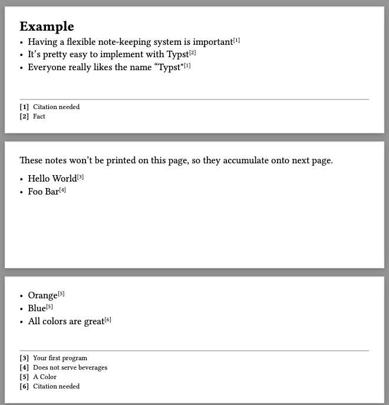

# notes.typ

Footnotes, endnotes, notes.



See [example.pdf](example/example.pdf) for the example PDF.


## Usage

### Quickstart

The easiest way to use this library is to place the `notes.typ` file
somewhere where you can import it, and do

```typst
#import "notes.typ": note, notes
```

at the top of your document.

Then, anywhere you want to place a note, do

```typst
- This is an *important* point #note[My note goes here]

// ...
// and where you want to render the notes:

#notes()
```

### Footnotes

If you want to always collect notes at the bottom of the page, you simply
call `#notes` in your footer:

```typst

#set page(
  footer: [
    This is my footer.

    #notes()
  ]
)
```

### Custom note rendering

The `notes` function is a sane-defaults function for displaying notes at
the bottom of a section / page.
You probably want to define your own by creating a function that a calls
`render_notes`.

You can use the `notes` function as a starting point:

```typst
#import "notes.typ": note, render_notes

// ...

#let notes(
  size: 8pt,
  font: "Roboto",
  line: line(length: 100%, stroke: 1pt + gray),
  padding: (top: 3mm),
  alignment: bottom,
  numberings: "1",
  group: note_default_group,
  reset: true,
  reset_counter: false
) = {
  let render(notes) = {
    if notes.len() > 0 {
      set align(alignment)
      block(breakable: false, pad(..padding, {
        if line != none { line }
        set text(size: size, font: font)
        for note in notes {
          [/ #text(font: "Roboto Mono")[[#numbering(numberings, note.index)]]: #note.text]
        }
      }))
    }
  }
  render_notes(group: group, reset: reset, reset_counter: reset_counter, render)
}
```

To customize the note marker, you can define your own `note` function
with the `display` argument set as you prefer:

```typst
#let mynote = note.with(
  display: (note) => {
    super(text(weight: "bold", fill: orange, note.index))
  }
)
```


### Advanced Usage

#### Reset note counter after each render of notes

```typst
#let mynotes = notes.with(reset_counter: true)
```

#### Two different note sets

If you want two different sets of note tracking states, you
can define your own "group" name.

The typical use-case might be footnotes + endnotes.

```typst
#let footnote = note.with(group: "footnote")
#let show_footnotes = notes.with(group: "footnote")

#let endnote = note.with(group: "endnote")
#let show_endnotes = notes.with(group: "endnote")
```

And then use then as normal

```typst
- I want to add something at the bottom of the page #footnote[My Footnote]
- I want to add something to the end of the document #endnote[My Endnote]
```

And your page footer could be

```typst
#set page(footer: show_footnotes)
```

while at the bottom of your document you have a call to

```typst
#show_endnotes()
```
